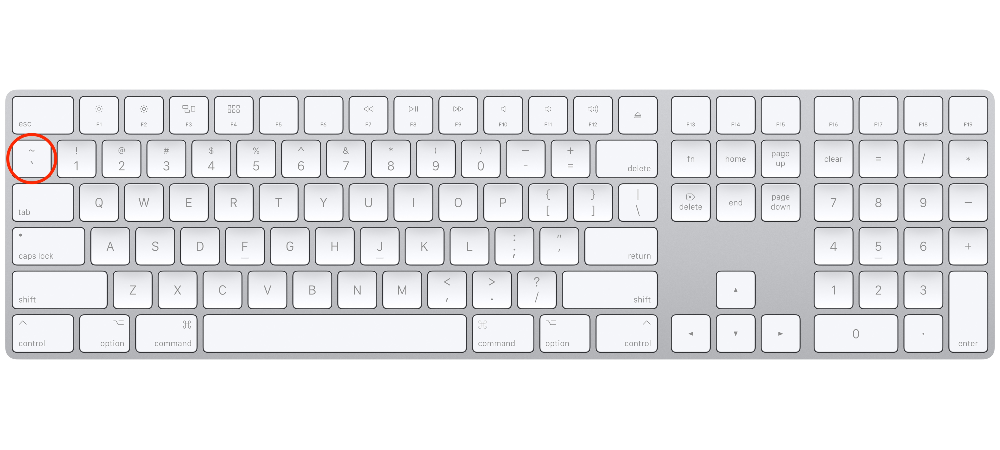
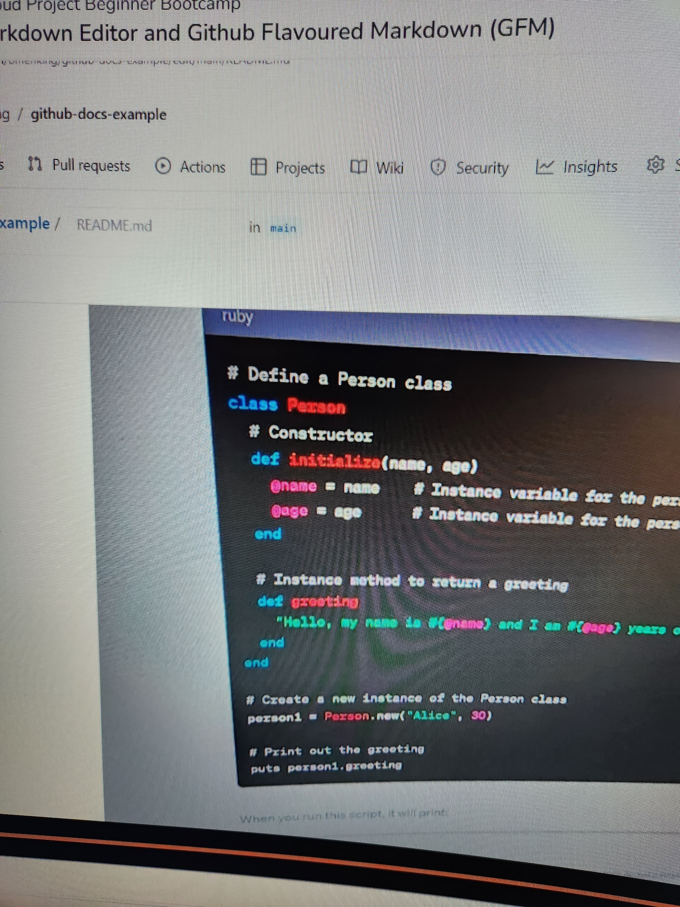
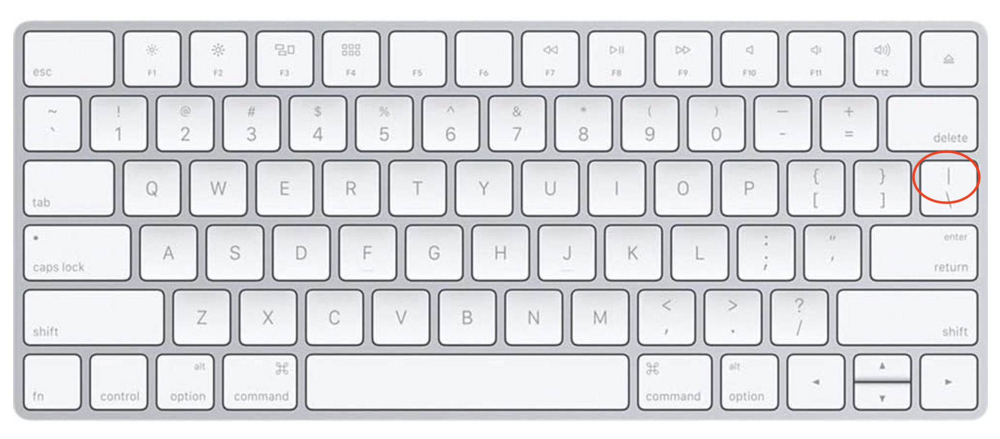

# Writing Good Documentation

## Step 1 - Using Codeblocks.

Codeblocks in markdown make it *very easy* for tech people to **copy, paste, share** code. A good _Cloud Engineer_ uses Codeblocks whenever possible.

Because it allows others to copy and paste their code to replicate or research issues.

- In order to create codeblocks in markdown you need to use three backticks (`)
- Not to be confused with single quotation (')

```
# Define an array of numbers
numbers = [1, 2, 3, 4, 5]

# Initialize a variable to store the sum
sum = 0

# Loop through the array and calculate the sum
numbers.each do |num|
  sum += num
end

# Print the result
puts "The sum of the numbers is: #{sum}"

With backticks
```

- When you can you should attempt to apply syntax highlighting to you codeblocks

 ```ruby
 # Define an array of numbers
numbers = [1, 2, 3, 4, 5]

# Initialize a variable to store the sum
sum = 0

# Loop through the array and calculate the sum
numbers.each do |num|
  sum += num
end

# Print the result
puts "The sum of the numbers is: #{sum}"
```

- Make note of where the backtick keyboard key is located.
- It should appear above the tab key,
- but it may vary based on your keyboard layout.

 

Good Cloud Engineers use codeblocks for both Code and Errors that appear in the console.


```bash
Traceback (most recent call last):
  File "<your_script_name>", line 2, in <module>
    undefined_variable = some_variable + 5
NameError: undefined local variable or method `some_variable' for main:Object
```

> Here is an example of using a codeblock for an error that appears in bash.

When you can always provide a codeblock instead of a screenshot.
If you need to take a screenshot make sure it nots a photo from your phone.

> There are certain cases where its okay to take photos with your phone. This is when you are showing something like a keyboard, which does not appear on a computer screen. If it render on your computer screen it should be a screenshot.

## Step 1 - How to take screenshots

A screenshot is when you capture a part of your screen from your laptop, desktop or phone.

This is not be confused with taking a photo with your phone.

**DON'T DO THIS**



This is what a screenshot from your computer should look like

**DO THIS INSTEAD**


To take screenshots on both Mac and Windows, you can use built-in hotkeys or keyboard shortcuts. Here are the common methods for taking screenshots on both platforms:

**Mac:**

1. **Capture Entire Screen**:
   - Press `Command (⌘) + Shift + 3`.
   - The screenshot will be saved to your desktop by default.

2. **Capture a Selected Portion of the Screen**:
   - Press `Command (⌘) + Shift + 4`.
   - Drag to select the area you want to capture.
   - The screenshot will be saved to your desktop.

3. **Capture a Specific Window**:
   - Press `Command (⌘) + Shift + 4`, then press the `Spacebar`.
   - Click on the window you want to capture.
   - The screenshot will be saved to your desktop.

4. **Take a Screenshot to Clipboard (without saving to a file)**:
   - Press `Command (⌘) + Control + Shift + 4`.
   - Drag to select the area you want to capture.
   - The screenshot will be copied to the clipboard for pasting into other applications.

**Windows:**

1. **Capture Entire Screen**:
   - Press `PrtScn` (Print Screen) key.
   - The screenshot is copied to your clipboard. You can paste it into an image editor like Paint or Word.

2. **Capture the Active Window**:
   - Press `Alt + PrtScn`.
   - The screenshot of the active window is copied to your clipboard.

3. **Capture a Custom Selection**:
   - Press `Windows + Shift + S` (Windows 10 and later).
   - Click and drag to select the area you want to capture.
   - The screenshot is copied to your clipboard and can be pasted into an image editor or document.

4. **Use Snipping Tool or Snip & Sketch** (Windows 10 and earlier):
   - Search for "Snipping Tool" or "Snip & Sketch" in the Start menu.
   - Open the tool, and you can use it to capture specific parts of your screen.

5. **Windows Snip & Sketch Shortcut** (Windows 10 and later):
   - Press `Windows + Shift + S`.
   - Choose the type of capture (rectangular, freeform, window) and capture the screen area.
   - The screenshot is copied to your clipboard.

These are the basic hotkeys for taking screenshots on Mac and Windows. The exact methods may vary slightly depending on your operating system version. Additionally, on Mac, you can customize where the screenshots are saved and their format using the "Screenshot" utility in the "Keyboard" preferences.
## Step 3 - Use Github Flavored Markdown Task Lists

Github extends Markdown to have a list where you can check off items. [<sup>[1]</sup>](#external-references)


- [x] Finish Step 1
- [ ] Finish Step 2
- [x] Finish Step 3

# Step 4 - Use Emojis (Optional)

GitHub Flavored Markdown (GFM) supports emoji shortcodes.
Here are some examples:

| Name | Shortcode | Emoji |
| --- | --- | --- |
| Cloud | `:cloud:` | :cloud: |
| Cloud with lighting | `:cloud_with_lighting:` | 🌩️ |

# Step 5 how to create a table


You can use the following markdown format to create tables:

```md
| Name | Shortcode | Emoji |
| --- | --- | --- |
| Cloud | `:cloud:` | :cloud: |
| Cloud with lighting | `:cloud_with_lighting:` | 🌩️ |
```
 Github extends the functionality of Markdown tables to provide alignment and table cell formatting option. [<sup>[2]</sup>](#external-references)

- Make note of where the pipe keyboard is located.
- It should appear above the return or enter key,
- but it may vary based on your keyboard layout.
 
 
 

 ## External References

- [Github Flavored Markdown Spec](https://github.github.com/gfm/) 
- [Bsic writing and formatting syntax (Github Flavored Markdown)](https://docs.github.com/en/get-started/writing-on-github/getting-started-with-writing-and-formatting-on-github/basic-writing-and-formatting-syntax#quoting-text) 
- [GFM - Task List](https://docs.github.com/en/get-started/writing-on-github/getting-started-with-writing-and-formatting-on-github/basic-writing-and-formatting-syntax#task-lists) <sup>[1]</sup>
- [GTM - Emoji CheatSheet](https://github.com/ikatyang/emoji-cheat-sheet)
- [GFM - Tables (with extensions)](https://github.github.com/gfm/#tables-extension-) <sup>[2]</sup>  
